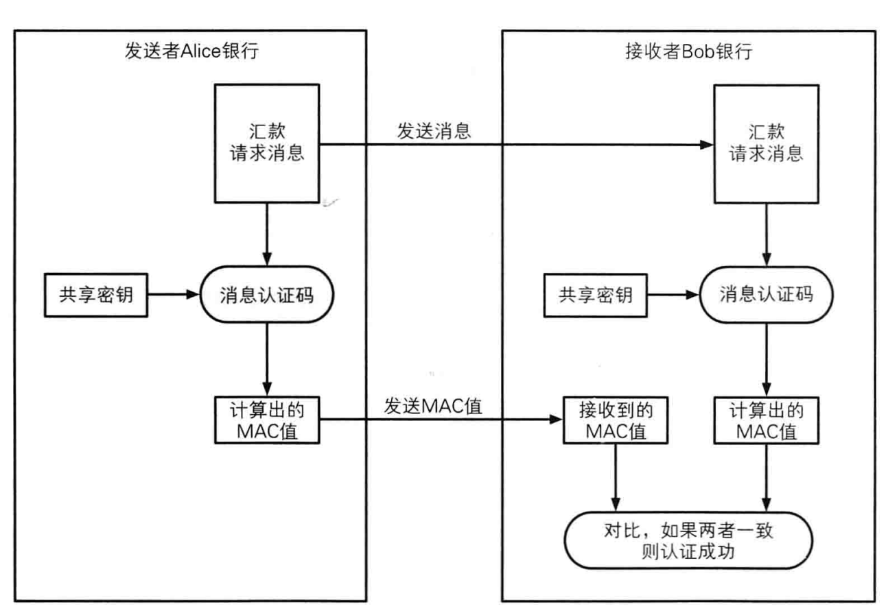

假如某一天，你收到了一封电子邮件：

```
发件人: alice@gmail.com

内容：
    我是 Alice，请借我 1000 块钱，打到账户 alice 上。
```

你会立刻打钱吗？

你肯定会有几个疑问：

- 发信的人真的是 Alice 吗？（认证）
- 万一真的是 Alice，我打了钱，最后 Alice 说这个邮箱不是的怎么办？（否认）
- 万一消息被黑客篡改了，银行账户变成了黑客的账户怎么办？（完整）

上述三条担忧对应了信息安全中的三条面临的威胁：

- **认证：** 消息发送者确实是我们希望的发送对象
- **否认：** 消息发送者不能否认自己发送过消息
- **完整：** 消息在整个过程中没有被篡改

消息认证码、数字签名和证书是用来解决上述问题的工具。

## 消息认证码

<!--  -->